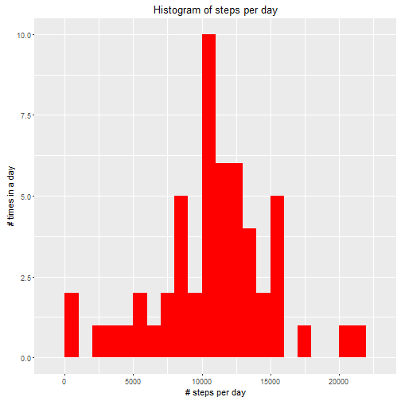
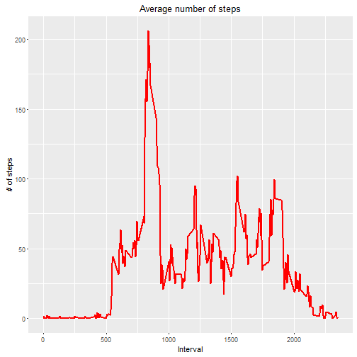
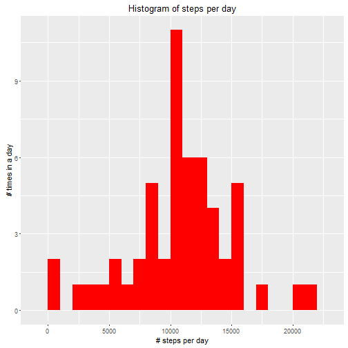
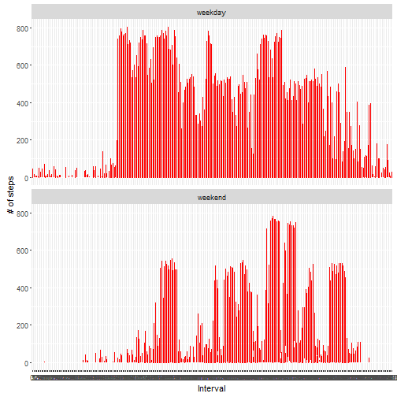

# Introduction

This document represents my results for the first course project of the coursera track "Reproducile Research". The structure of this document follows the questions, which are asked in the document: https://www.coursera.org/learn/reproducible-research/peer/gYyPt/course-project-1

The data set for this report can also be found in the above mentioned URL.

### Loading and preprocessing the data

The outcome of this chapter will by a tidy data frame "act_base", which will be used for all further processing.
.
#### Load libraries

Since I use R3.2.2 I will supress the warnings for libraries compiled with R3.2.3.


```r
options(warn=-1)
library(data.table)
library(ggplot2)
library(knitr)
```

#### Load the data (i.e. read.csv()).


```r
setwd("~/Coursera/ReproducableResearch/week1")
act_raw <- read.csv("activity.csv", stringsAsFactors=FALSE)
```

#### Process/transform the data (if necessary) into a format suitable for your analysis.

Examine the data.


```r
# Examine raw data
str(act_raw)
```

```
## 'data.frame':	17568 obs. of  3 variables:
##  $ steps   : int  NA NA NA NA NA NA NA NA NA NA ...
##  $ date    : chr  "2012-10-01" "2012-10-01" "2012-10-01" "2012-10-01" ...
##  $ interval: int  0 5 10 15 20 25 30 35 40 45 ...
```

Cleanup the data for the following reasons:

- Variable steps contains NA values (will be ignored at the moment, using rm.na)
- Variable date has data type character -> date
- Variable interval has data type int -> factor


```r
act_raw$date <- as.Date(act_raw$date, format = "%Y-%m-%d")
act_raw$interval <- as.factor(act_raw$interval)
act_base <- act_raw
```

Check the result.


```r
# Examine raw data
str(act_base)
```

```
## 'data.frame':	17568 obs. of  3 variables:
##  $ steps   : int  NA NA NA NA NA NA NA NA NA NA ...
##  $ date    : Date, format: "2012-10-01" "2012-10-01" ...
##  $ interval: Factor w/ 288 levels "0","5","10","15",..: 1 2 3 4 5 6 7 8 9 10 ...
```

### What is mean total number of steps taken per day?

#### Calculate the total number of steps taken per day.


```r
steps_sum <- aggregate(steps ~ date, act_base, sum)
colnames(steps_sum) <- c("date","steps")
str(steps_sum)
```

```
## 'data.frame':	53 obs. of  2 variables:
##  $ date : Date, format: "2012-10-02" "2012-10-03" ...
##  $ steps: int  126 11352 12116 13294 15420 11015 12811 9900 10304 17382 ...
```

#### Make a histogram of the total number of steps taken each day.


```r
ggplot(steps_sum, aes(x = steps)) + 
  geom_histogram(fill = "red", binwidth = 1000) + 
  labs(title="Histogram of steps per day", 
       x = "# steps per day", y = "# times in a day") 
```



#### Calculate and report the mean and median of the total number of steps taken per day.


```r
steps_mean <- mean(steps_sum$steps, na.rm=TRUE)
print(steps_mean)
```

```
## [1] 10766.19
```

```r
steps_median <- median(steps_sum$steps, na.rm=TRUE)
print(steps_median)
```

```
## [1] 10765
```

### What is the average daily activity pattern?

#### Make a time series plot of the 5-minute interval (x-axis) and the average number of steps taken, averaged across all days (y-axis).


```r
steps_interval <- aggregate(act_base$steps, by = list(interval = act_base$interval), FUN=mean, na.rm=TRUE)
# Convert column variable interval from factor to integer for plotting in ggplot
steps_interval$interval <- as.integer(levels(steps_interval$interval)[steps_interval$interval])
colnames(steps_interval) <- c("interval", "steps")

ggplot(steps_interval, aes(x=interval, y=steps)) +   
  geom_line(color="red", size=1) +  
  labs(title="Average number of steps", x="Interval", y="# of steps")
```



#### Which 5-minute interval, on average across all the days in the dataset, contains the maximum number of steps?


```r
steps_interval_max <- steps_interval[which.max(steps_interval$steps),]
print(steps_interval_max)
```

```
##     interval    steps
## 104      835 206.1698
```


### Imputing missing values

Calculate and report the total number of missing values in the dataset (i.e. the total number of rows with NAs)


```r
act_impute <- act_base
idx_na <- is.na(act_impute$steps)
act_impute_mean <- aggregate(act_impute$steps, by = list(interval = act_impute$interval), FUN=mean, na.rm=TRUE)
colnames(act_impute_mean) <- c("interval", "steps") 
act_impute$steps[idx_na] <- act_impute_mean$steps[idx_na]
```

Counting NA steps
 
 ```r
 sum(is.na(act_impute$steps))
 ```
 
 ```
 ## [1] 2016
 ```

#### Make a histogram of the total number of steps taken each day and Calculate and report the mean and median total number of steps taken per day. 


```r
steps_impute_sum <- aggregate(steps ~ date, act_impute, sum)
colnames(steps_impute_sum) <- c("date","steps")
str(steps_impute_sum)
```

```
## 'data.frame':	54 obs. of  2 variables:
##  $ date : Date, format: "2012-10-01" "2012-10-02" ...
##  $ steps: num  10766 126 11352 12116 13294 ...
```

```r
ggplot(steps_impute_sum, aes(x = steps)) + 
  geom_histogram(fill = "red", binwidth = 1000) + 
  labs(title="Histogram of steps per day", 
       x = "# steps per day", y = "# times in a day")  
```



#### Do these values differ from the estimates from the first part of the assignment?

Values differ, as shown below:


```r
steps_impute_mean <- mean(steps_impute_sum$steps, na.rm=TRUE)
print(steps_impute_mean)
```

```
## [1] 10766.19
```

```r
steps_impute_median <- median(steps_impute_sum$steps, na.rm=TRUE)
print(steps_impute_median)
```

```
## [1] 10765.59
```

### Are there differences in activity patterns between weekdays and weekends?

#### Create a new factor variable in the dataset with two levels - "weekday" and "weekend" indicating whether a given date is a weekday or weekend day.


```r
is_weekday <- function(d) {
  wd <- weekdays(d)
  ifelse (wd == "Samstag" | wd == "Sontag", "weekend", "weekday")
}
wx <- sapply(act_impute$date, is_weekday)
act_impute$wk <- as.factor(wx)
str(act_impute)
```

```
## 'data.frame':	17568 obs. of  4 variables:
##  $ steps   : num  1.717 0.3396 0.1321 0.1509 0.0755 ...
##  $ date    : Date, format: "2012-10-01" "2012-10-01" ...
##  $ interval: Factor w/ 288 levels "0","5","10","15",..: 1 2 3 4 5 6 7 8 9 10 ...
##  $ wk      : Factor w/ 2 levels "weekday","weekend": 1 1 1 1 1 1 1 1 1 1 ...
```

#### Make a panel plot containing a time series plot (i.e. type = "l") of the 5-minute interval (x-axis) and the average number of steps taken, averaged across all weekday days or weekend days (y-axis).


```r
ggplot(act_impute, aes(x=interval, y=steps)) + 
  geom_line(color="red") + 
  facet_wrap(~ wk, nrow=2, ncol=1) +
  labs(x="Interval", y="# of steps") 
```



#### Generate Output
```
# knit2html(input="PA1_template.Rmd", output="PA1_template.html") 
# rmarkdown::render(input="PA1_template.Rmd", output_format="PDF" output_file="PA1_template.html")
```
